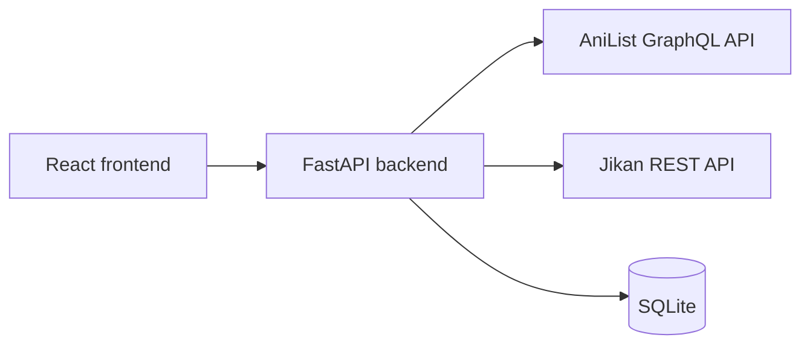

# Anime Recommendation App

A full-stack web application for discovering anime recommendations, exploring similar titles, and maintaining a personal watchlist. The application combines live data from the AniList GraphQL and Jikan REST APIs with a local SQLite cache so previously retrieved recommendations can remain available during upstream API failures.

## Features

- Search for anime and receive detailed recommendations
- View similar anime for individual results
- Save and remove titles from a persistent watchlist
- Use AniList and Jikan with automatic fallback between data sources
- Cache recommendation data locally for improved resilience
- Track which API or cache supplied each result
- Configure frontend URLs, database paths, and CORS origins through environment variables
- Verify backend availability through a `/health` endpoint

## Tech Stack

| Layer | Technologies |
| --- | --- |
| Frontend | React, JavaScript, Vite, CSS |
| Backend | Python, FastAPI, Pydantic |
| Database | SQLite |
| External APIs | AniList GraphQL API, Jikan REST API |
| Tooling | Git, GitHub, Node.js, npm, Uvicorn |

## Architecture

The React frontend sends requests to the FastAPI backend. The backend retrieves live anime data from AniList or Jikan, stores reusable results in SQLite, and falls back to cached data when a live recommendation request is unavailable. SQLite also stores the user's watchlist across sessions.



## Run Locally

### Prerequisites

Install the following before starting:

- [Git](https://git-scm.com/downloads)
- Python 3.10 or newer
- Node.js `^20.19.0` or `>=22.12.0`
- npm (included with Node.js)

### 1. Clone the repository

```bash
git clone https://github.com/Zaib146/anime-recommendation-app.git
cd anime-recommendation-app
```

### 2. Set up the backend

Create a virtual environment from the repository root.

Windows PowerShell:

```powershell
py -m venv .venv
.\.venv\Scripts\Activate.ps1
python -m pip install -r backend/requirements.txt
Copy-Item backend/.env.example backend/.env
```

macOS or Linux:

```bash
python3 -m venv .venv
source .venv/bin/activate
python -m pip install -r backend/requirements.txt
cp backend/.env.example backend/.env
```

Initialize the local SQLite database and start the API:

```bash
cd backend
python database_setup.py
python -m uvicorn main:app --reload
```

The backend runs at `http://localhost:8000`. Keep this terminal open while using the application.

Verify the API is healthy by opening:

- Health check: `http://localhost:8000/health`
- Interactive API documentation: `http://localhost:8000/docs`

The health check should return:

```json
{"status":"healthy"}
```

### 3. Set up the frontend

Open a second terminal and return to the repository root. Then run:

Windows PowerShell:

```powershell
cd frontend
Copy-Item .env.example .env
npm install
npm run dev
```

macOS or Linux:

```bash
cd frontend
cp .env.example .env
npm install
npm run dev
```

Open the local URL shown by Vite, normally `http://localhost:5173`.

## Environment Configuration

The committed `.env.example` files document the variables needed for local development. The actual `.env` files are intentionally excluded from Git.

### Backend

`backend/.env`:

```env
DATABASE_URL=anime_app.db
ALLOWED_ORIGINS=["http://localhost:5173"]
```

- `DATABASE_URL` selects the SQLite database file.
- `ALLOWED_ORIGINS` defines which frontend origins may call the API through CORS.

### Frontend

`frontend/.env`:

```env
VITE_API_URL=http://localhost:8000
```

- `VITE_API_URL` defines the backend base URL used by frontend requests.

Restart the relevant development server after changing an environment file.

## API Endpoints

| Method | Endpoint | Purpose |
| --- | --- | --- |
| `GET` | `/health` | Confirm that the backend is running |
| `GET` | `/recommendations/{anime_name}` | Retrieve anime recommendations |
| `POST` | `/similar-anime` | Retrieve similar titles for an anime |
| `GET` | `/watchlist` | Retrieve saved watchlist entries |
| `POST` | `/watchlist` | Save an anime to the watchlist |
| `DELETE` | `/watchlist/{anime_id}` | Remove an anime from the watchlist |

Request and response schemas can be explored through FastAPI's interactive documentation at `http://localhost:8000/docs` while the backend is running.

## Development Checks

Run frontend quality checks from `frontend`:

```bash
npm run lint
npm run build
```

For a backend smoke test, start the API and confirm that `/health` returns HTTP `200` with `{"status":"healthy"}`.

## Project Status

The application currently runs locally with environment-based configuration, API fallback behavior, SQLite persistence, and a backend health check. The next major phase is AWS deployment, with the frontend and backend configuration already separated from local-only URLs and paths.

Planned deployment work includes:

- Hosting the React frontend with Amazon S3 and CloudFront
- Running the FastAPI backend on Amazon EC2
- Migrating persistent production data from SQLite to PostgreSQL on Amazon RDS
- Adding CloudWatch monitoring and deployment verification

These are planned improvements and are not part of the current local implementation.
